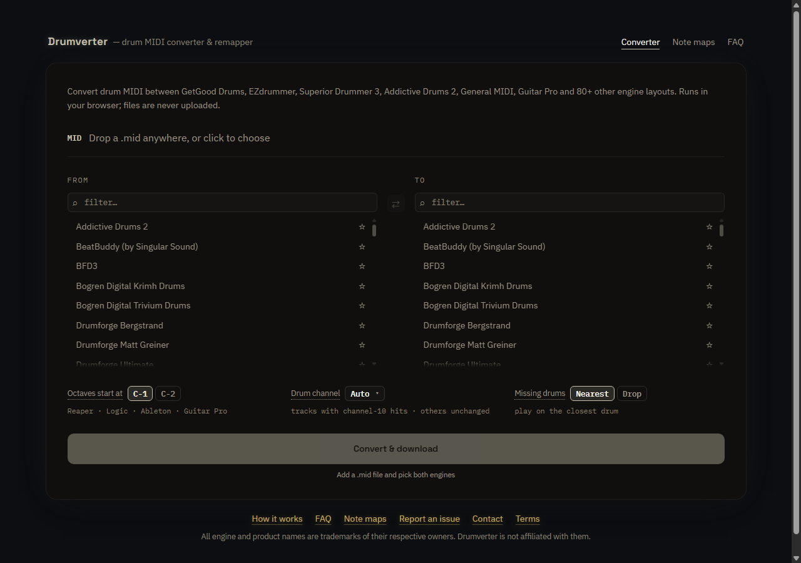

# Drumverter

Convert drum MIDI between sample-engine note layouts — GetGood Drums, EZdrummer,
Superior Drummer 3, Addictive Drums 2, General MIDI, Guitar Pro and 80+ others.

**Use it at [drumverter.com](https://drumverter.com).** It runs in your browser; files
are never uploaded.



- Every note goes through a shared drum vocabulary, so any engine converts to any other.
- A drum the target lacks is played on the nearest one it has (a China on a crash), or
  left out if you choose **Drop**; ghost notes and rimshots always fall back to a plain
  hit on the same drum.
- Each conversion comes with a report of approximated, dropped and unrecognized notes,
  with links to fix them in the note editor. Edits can be saved as presets.
- Batch conversion, drum-channel selection, and a command-line tool for offline use.

## Workspace

| Path | What it is |
|---|---|
| `midiremap-core` | Pure Rust engine: canonical drums, fallback chains, MIDI rewrite, loss report |
| `midiremap-cli` | Offline `convert` / `list` command |
| `midiremap-wasm` | Browser bindings used by the app |
| `midiremap-site` | Static pages: per-engine note maps, pair tables, FAQ and guide |
| `app/` | Vite + React + TypeScript converter UI |
| `engines/*.toml` | One note map per engine, embedded at build time |

[ARCHITECTURE.md](ARCHITECTURE.md) explains the design; [app/README.md](app/README.md)
covers the UI.

## Build and test

Requirements: rustup (it installs the Rust version pinned in `rust-toolchain.toml`,
wasm target included), a nightly toolchain for `rustfmt`, Node 20.19+ (`.nvmrc`), and
`wasm-bindgen-cli` at the version in `Cargo.lock`.

```bash
cargo +nightly fmt --all
cargo clippy --workspace --all-targets -- -D warnings
cargo test --workspace

cd app
npm ci
npm run dev          # builds the wasm module, then starts Vite
npm run lint
npm test
npm run build:site   # app + static pages into app/dist
```

Every push to `master` runs the same checks in CI and deploys only when all pass.

## Command line

```bash
cargo run -p midiremap-cli -- list
cargo run -p midiremap-cli -- convert in.mid ggd_invasion ezdrummer out.mid \
    [--channel auto|all|1-16] [--missing nearest|drop] [--overrides edits.json]
```

The loss report is printed to stderr as JSON.

## Adding an engine

Drop a `.toml` note map into `engines/` (see any existing file for the format) and run
the tests; the catalog tests check it, and it ships with the next build.

## Licence

[MIT](LICENSE). Engine and product names are trademarks of their respective owners;
Drumverter is not affiliated with them.
